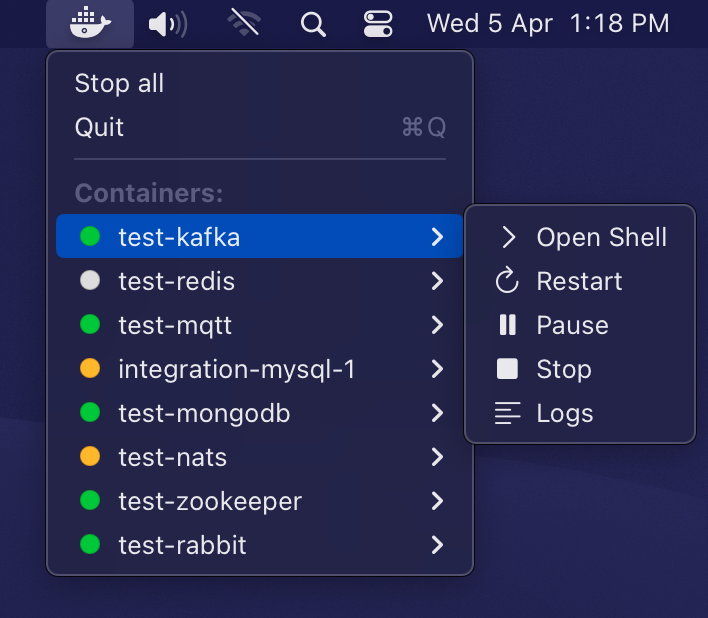
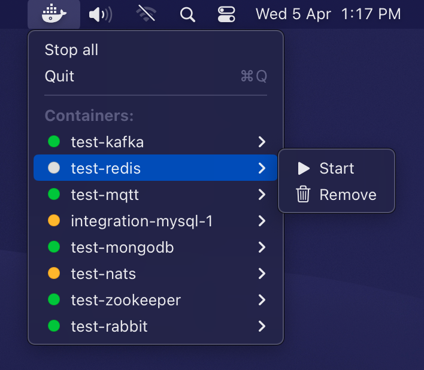

# Dockermenu

A small application for your MacOS menu bar that lists all running docker containers.

**Screenshots**:

  
  
</p3

## Installation

You can either build it yourself (see details further down). Or download
the zip archive from [releases](/releases) and run `dockermenu.app`.

## Build and run

1. Open the project in Xcode
2. Click on the `Product` -> `Archive` menu item
3. Click "Export..."
4. Chose "Export as a Mac Application"

This should generate a `dockermenu.app` ready to be run.
